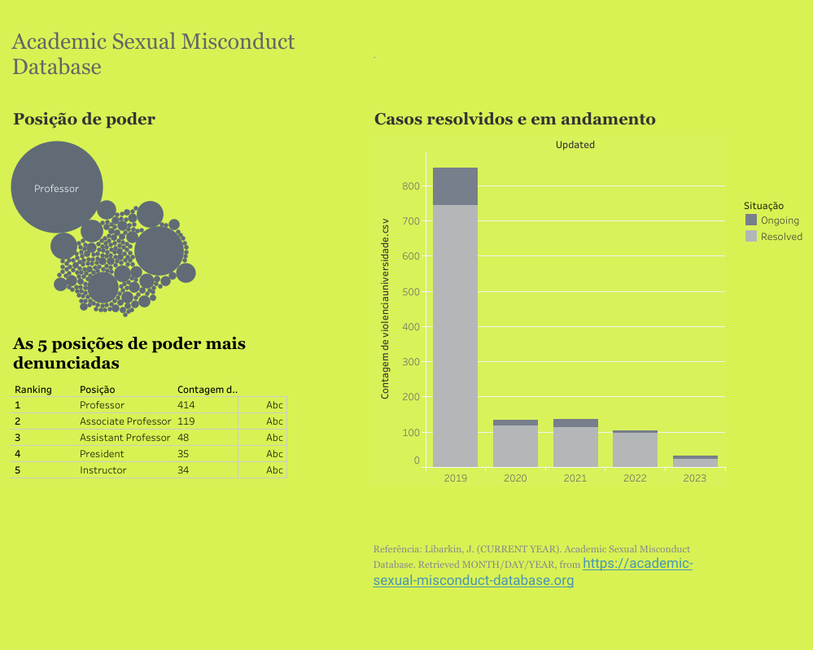
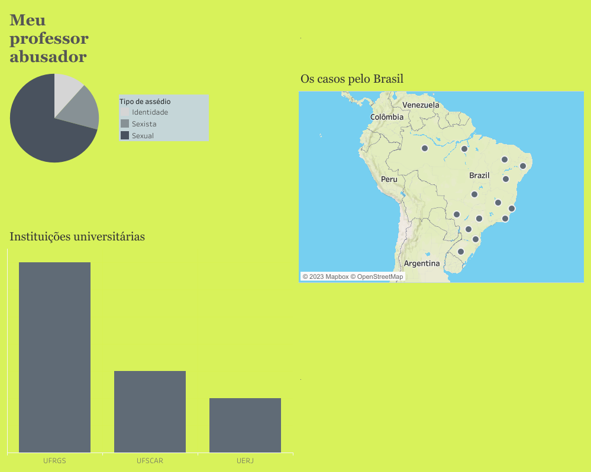

<h1 align="center">
  
</h1>

# Projeto final

### Título do projeto

Pacto de silêncio: análise de dados sobre violência de gênero na universidade.

### Contexto
O projeto propõe a partir de bases de dados sobre violência de gênero em universidades refletir um cenário de normatização e silenciamento de crimes como assédios e abusos ocorridos em instituições universitárias. 

### Objetivo geral

Descrever bases de dados sobre casos de violência de gênero em universidades.

### Objetivos específicos 

1. Compreender através das bases de dados o cenário de denúncias na univerdade;

2. Caracterizar a violência de gênero no ambiente universitário através dos dados;

3. Analisar comparativamente os dados internacionais e nacionais sobre o crime.

### Base de dados

- Academic Sexual Misconduct Database (https://academic-sexual-misconduct-database.org/download-data)
- Meu professor abusador (Coleta independente: https://web.facebook.com/profile.php?id=100071438764857)

### Ferramentas 

* Em abordagem estritamente quantitativa, a proposta exploratória adotará o uso da linguagem de programação `Python`, para manipulação dos dados (limpeza e tratamento dos dados, análise exploratória dos dados- EDA) as bibliotecas `Pandas` e `Matplotlib`. Para análise visual usaremos a ferramenta `Tableau`.

### Tableau Public - Dashboard

🔸 Má conduta sexual acadêmica (https://public.tableau.com/views/ProjetofinalReprograma/DashboardUniversidades?:language=pt-BR&:display_count=n&:origin=viz_share_link)
<h1 align="center">
  
</h1>

🔸Meu professor abusador (https://public.tableau.com/views/ProjetofinalReprograma3/Painel5?:language=pt-BR&:display_count=n&:origin=viz_share_link)
<h1 align="center">
  
</h1>

### Referências
 
 - https://pandas.pydata.org/docs/reference/api/pandas.DataFrame.dropna.html
 - https://github.com/LuisCSGuimaraes/AnaliseAirbnbToronto/blob/main/Notebook
 Analisando%20os%20Dados%20de%20Toronto%20-%20Canada%20-%20Airbnb.ipynb
 - https://educadiversidade.unesp.br/guia-de-prevencao-e-identificacao-do-assedio-sexual-sexista-por-orientacao-sexual-por-identidade-ou-expressao-de-genero/
 - https://www.linkedin.com/feed/update/urn:li:activity:7136681258096463872?updateEntityUrn=urn%3Ali%3Afs_updateV2%3A%28urn%3Ali%3Aactivity%3A7136681258096463872%2CFEED_DETAIL%2CEMPTY%2CDEFAULT%2Cfalse%29

 ### Agradecimentos

 Agradeço à equipe {Reprograma} por todo suporte, às professoras, à Jani por ser uma facilitadora incrível, pela escuta cuidadosa da Ju e May. Gratidão pelas minhas colegas de turma da ON26, nunca vou esquecer da preciosidade que foi compartilhar o curso com vocês. À minha familia pelo apoio e minhas queridas e divertidas amigas! 
